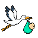

# Untitled Stork Game
Fly, dodge, and deliver. Control a stork while avoiding clouds and managing your health before time runs out!

 

A simple 2D pixel art game where you have to guide a stork to deliver a baby, controlling your speed and altitude to avoid dangerous clouds. 
Time is not on your side, so hurry up before your baby pays the consequences. Reach the end and discover if you were able to bring a healthy baby to his home or not.

## Play it
You can play it on itch.io [here](https://bort2441.itch.io/untitled-stork-game)

or directly [download it](https://github.com/Bort-s/Untitled-Stork-Game/releases/download/v1.0.2/Untitled.Stork.Game.1.0.2.zip) (only Windows).
## Steps
1. Download the game build ZIP
2. Unzip it
3. Search and open the .exe file
4. Allow the game to open to any external program, like an antivirus (for **Windows SmartScreen**, click "*More info*" and "*Run anyway*").
5. **Play!**

## How to play
 
- Your mission is to deliver the baby to his house
- You have to avoid clouds to achieve your mission
- The clouds in the top and bottom also hurt you
- The green bar indicates how close you are to the baby's house
- The red bar indicates your current HP
- The shield bar indicates the state of your shield
### Controls
- W/S to move up and down
- A/D to decrease and increase game speed (the faster you go, the faster you deliver the baby, but also the faster clouds spawn)
- E to activate the shield for 5 seconds

## About
Made in Unity. As it is my first game, I wanted to keep it simple but polished. The game is clearly inspired by the well-known story of babies coming from storks.

### AI Disclosure
AI was only used for debugging the code.

 
